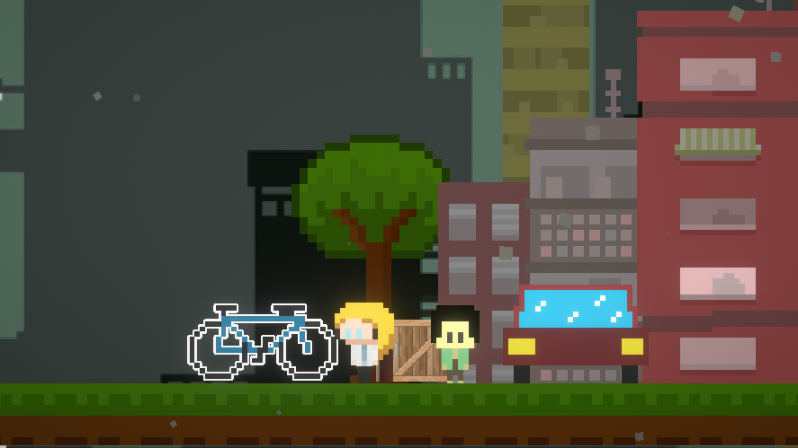

# 🌍 Eco-Shift: A Playable Climate Story  

  
*Click the image above to watch the gameplay demo on YouTube*  

**Eco-Shift** is an educational game built with the **Unity Engine** and **C#**, designed to translate complex climate science into an interactive experience.  
Rather than presenting facts in static charts, Eco-Shift places players in a **side-scrolling, story-driven world** where every decision nudges Earth’s future in a better — or worse — direction.  

---
## 🎮 Why Eco-Shift?
Climate change is one of the most pressing challenges of our time, yet communicating its urgency to younger audiences often falls short. Reports are overwhelming, and statistics feel abstract.  

Eco-Shift tackles this gap by combining:
- **Scientific accuracy** → Real datasets from the [U.S. Greenhouse Gas Center](https://www.epa.gov/ghgemissions).  
- **Accessible design** → A pixel-art side scroller that feels familiar but carries weight.  
- **Decision-based storytelling** → Players see the *immediate consequences* of their actions, not just numbers on a graph.  

Guided by atmospheric scientist **Dr. Róisín Commane**, players travel through pivotal moments in climate history, learning how individual and collective choices ripple across generations.  

---
## 🧩 Core Mechanics
- **Interactive Choice System** → Every decision affects both visuals and outcomes.  
- **Temporal Progression** → Move from the pre-industrial era to modern climate challenges.  
- **Dynamic Feedback** → Positive actions reinforce sustainability, while harmful ones produce visible degradation.  
- **Real Data Integration** → Game logic ties directly to greenhouse gas datasets for authenticity.  

---
## 👥 Who It’s For
- **Students (7–18)** → Players who spend time on games and social media but often lack structured climate knowledge.  
- **Educators & NGOs** → Institutions seeking accessible, gamified tools for climate literacy.  
- **Curious Learners** → Anyone interested in exploring climate decisions through play, not just text.  

---
## 🛠️ Technical Stack

| Aspect            | Details |
|-------------------|---------|
| **Engine**        | Unity Engine |
| **Language**      | C# |
| **Game Type**     | Side Scroller |
| **Art Style**     | Pixel Art |
| **Art Pipeline**  | [Aseprite](https://www.aseprite.org/) |
| **IDE**           | [IntelliJ IDEA](https://www.jetbrains.com/idea/) |
| **Build Output**  | HTML + JS |
| **Launcher**      | Web + Unity Web Player |

---
## 📸 Screenshots & Media

### 🎮 Gameplay Snapshots  
*(Replace placeholders with real screenshots from `/photos` folder)*

| Side-Scrolling Gameplay | Decision Example | Different Endings |
|--------------------------|------------------|-------------------|
|  |  |  |

---

### 🎨 Pixel Art Showcase  

|  |  |  |
|------------------------------------------|-----------------------------------------------|------------------------------------------------|
|  |  | |

